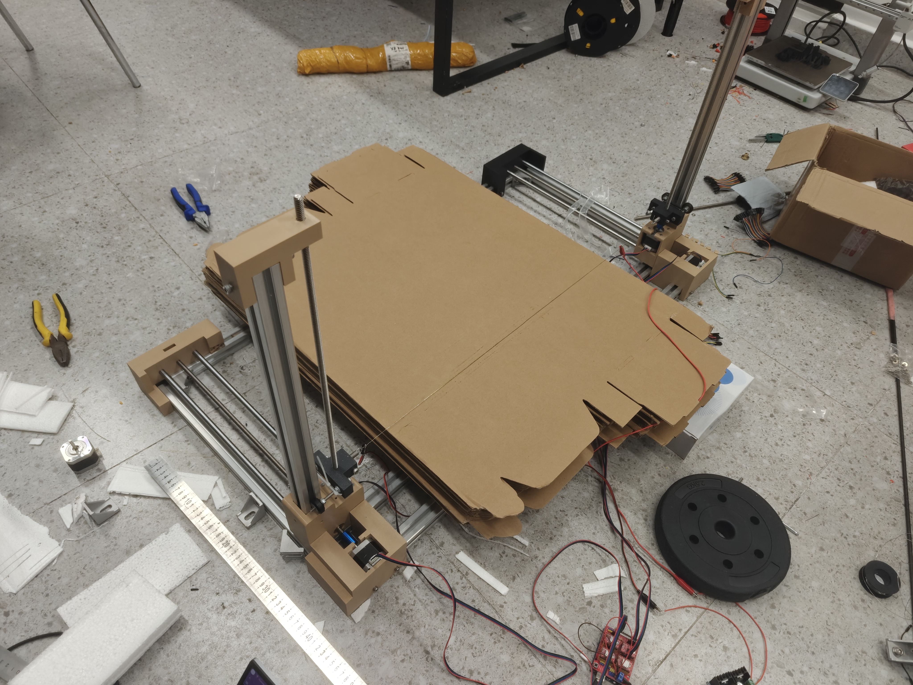

<div align="left">
  
</div>

# Foam Wing Station 泡沫机翼切割站

一款专为航模爱好者设计的 4 轴 CNC 泡沫机翼切割完整解决方案。旨在实现“炸鸡自由”，复刻简单且成本低廉。


##  上位机软件

基于 React + Three.js 开发的集成化设计与控制终端。

在线使用：[`FoamWingStation`](https://pencilcore.github.io/FoamWingStation/) 
### 快速启动
```powershell
# 进入项目目录
cd foam-wing-station

# 安装依赖
npm install

# 启动开发服务器
npm run dev
```

## 🛠 固件
本项目配套专为热线切割机优化的 **GRBL 4轴版本**，已移植至 Arduino UNO。
[`grbl_uno_4axes`](https://github.com/PencilCore/grbl_uno_4axes/) 

## 🏗 复刻教程

<div align="left">
  
</div>

本教程基于 100x50cm 大型机架设计，实际支持约 80cm 长度的机翼切割。您可以根据需求按比例缩放。

### 1. 硬件材料清单 (BOM)

| 类别 | 项目 | 规格/说明 | 数量 |
| :--- | :--- | :--- | :--- |
| **传动组件** | T8 丝杆 + 螺母 | 50cm (根据行程定) | 4 套 |
| | 光轴 | 10mm 直径, 50cm | 4 根 |
| | 直线轴承 | LM10UU | 4 个 |
| | 联轴器 | 5mm to 8mm | 4 个 |
| | POM 轮 | 标准型 | 4 个 |
| **结构件** | 铝型材 | 3030 规格 (长100cmx2, 宽/高50cmx4) | 1 套 |
| | 连接件 | L型连接块、3030 专用螺母螺丝 | 若干 |
| | 打印件 | JLC 零件加工或自行 3D 打印 | 1 套 |
| **电子硬件** | 主控板 | Arduino UNO | 1 块 |
| | 扩展板 | CNC Shield V3.0 | 1 块 |
| | 驱动模块 | A4988 步进驱动 | 4 块 |
| | 步进电机 | NEMA17 (4240) 带线 | 4 台 |
| **加热/附件** | 加热丝 | 镍铬丝 | 适量 |
| | 调压模块 | 降压恒流模块 (控制热丝电压) | 1 个 |
| | 电源 | 12V - 24V 适配器 | 1 套 |
| | 其他 | 鳄鱼夹、拉簧 (0.8-8-30)、扎带、底板 | 若干 |

### 2. 构建说明
- **型材规格**：目前使用 3030 型材（未来计划迁移至 2020 规格以降低成本）。
- **有效行程**：型材长度需比预期切割长度多留约 20cm（打印件占位）。
- **安全提醒**：请确保底板使用耐高温或阻燃材料。

---
*教程持续更新中...*


